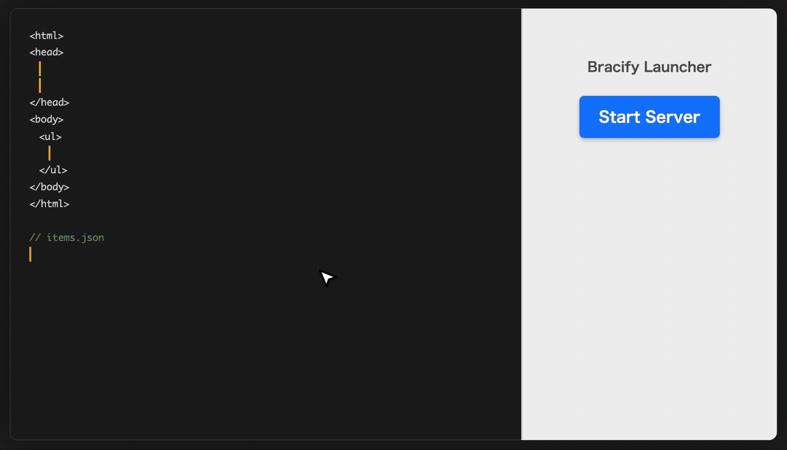

[English](./README.en.md) | [Español](./README.es.md) | [Português](./README.pt.md) | [简体中文](./README.zh.md) | [한국어](./README.kr.md) | [日本語](./README.md)

<p align="center">
  
</p>

# Bracify 🚀

> **El framework web solo con HTML. Sin CLI, solo marcado.**

Bracify es un framework que permite construir aplicaciones web utilizando únicamente marcado HTML.
Ofrecemos una experiencia de desarrollo centrada en HTML ("HTML-first"), eliminando las barreras de la programación y la configuración compleja de entornos.

## ¿Qué es Bracify?

Bracify busca la simplicidad: "Crea aplicaciones solo con marcado".

- **Para ingenieros cansados de React/Vue**: Libérate de configuraciones de construcción complejas y de la curva de aprendizaje de frameworks pesados.
- **Para ingenieros de marcado (maquetadores)**: Sin necesidad de programar. Usa solo tus habilidades de HTML para crear aplicaciones web completas, desde la integración de datos hasta el despliegue.

## Demo



## Conceptos clave

- **Solo marcado HTML**: Crea aplicaciones solo marcando HTML, sin escribir programas.
- **Sin necesidad de CLI**: No se requiere de "pantalla negra" (terminal). Nuestro lanzador GUI dedicado lo resuelve todo.
- **Renderizado híbrido**: Desarrolla con `file://` (CSR) y publica como servidor `https://` (SSR) tal cual.
- **Configuración cero**: No se necesita el complejo `npm install`, etc.
- **Portátil**: El proyecto es solo HTML. Llévalo a cualquier parte y ejecútalo de inmediato.

## Inicio rápido

Comencemos creando una página simple. Solo toma 4 pasos.

### 1. Preparación

Inicia la aplicación GUI de `Bracify` y selecciona una nueva carpeta de espacio de trabajo.

### 2. Crear HTML

Crea un archivo llamado `index.html` y escribe lo siguiente:

```html
<!DOCTYPE html>
<html>
<head>
  <!-- Especificar fuente de datos -->
  <link data-t-source="info" href="/_sys/data/info.json">
</head>
<body>
  <h1>{info.msg}</h1>
</body>
</html>
```

### 3. Crear datos

Crea un archivo llamado `/_sys/data/info.json` y escribe lo siguiente:

```json
{
  "msg": "¡Hola Bracify!"
}
```

### 4. Ejecutar

Al presionar el botón `Start Server` en la aplicación GUI, se genera una carpeta `_dist` en tu espacio de trabajo. Al abrir el archivo `index.html` dentro de la carpeta `_dist` en tu navegador, se mostrará `¡Hola Bracify!`. Al abrir `localhost:3000` se mostrará lo mismo.
Disfruta de la experiencia de mostrar datos solo con HTML, sin escribir nada de JavaScript.

---

## Herramientas de desarrollo (Bracify Studio)

`Bracify` proporciona una herramienta GUI dedicada (nombre en clave: **Bracify Studio**) para maximizar la experiencia del desarrollador.
Esta herramienta funciona en una configuración híbrida de un "Lanzador" basado en Electron y un "Panel de administración (Web App)" construido con el propio `Bracify`.

### 1. Bracify Launcher (Escritorio)

Una aplicación ligera que sirve de envoltorio para iniciar el Panel de administración.

- **Servidor del sistema**: Inicia un servidor API de gestión del sistema al lanzar la aplicación.
- **Lanzar**: Abre automáticamente el Panel de administración en un navegador (o ventana de Electron).

### 2. Panel de administración (Web)

Una pantalla de gestión integrada que consolida todas las operaciones.

- **Control de proyectos**:
  - **Abrir proyecto**: Abre un diálogo de selección de carpetas a través de la API del sistema para cargar proyectos.
  - **Iniciar/Detener servidor**: Especifica un número de puerto para iniciar el servidor de previsualización para el proyecto de destino.
- **Gestor de datos**:
  - Edición de JSON, estimación de esquemas.
- **Monitor de API**:
  - Consultar registros de comunicación.
- **Construcción estática**:
  - Ejecutar la generación de sitios estáticos.

---

## Estructura del proyecto (File System Structure)

Un proyecto de `Bracify` consiste en una carpeta de edición de código fuente (raíz) y una carpeta de salida (`_dist`).

### Estructura de directorios recomendada

```text
proyecto/
├── index.html          # Punto de entrada (objetivo de edición)
├── style.css           # Recurso estático
├── img/                # Activos como imágenes
│   └── logo.png
├── _parts/             # Componentes para incluir (no incluidos en los resultados de construcción)
│   ├── header.html
│   └── footer.html
├── _sys/               # Datos del sistema y configuración (no incluidos en los resultados de construcción)
│   └── data/
│       └── articles.json
└── _dist/              # [Auto-generado] Destino de salida de construcción (el producto final va aquí)
    ├── index.html
    ├── style.css
    └── img/
        └── logo.png
```

### Especificaciones de construcción

Cuando ejecutas una "Construcción" (Build) a través de la GUI o la línea de comandos, la salida se genera en la carpeta `_dist` según las siguientes reglas:

1. **Procesamiento de archivos HTML**:
    - Los archivos `.html` en el directorio raíz se envían a `_dist` con `data-t-include` resuelto (componentes fusionados).
2. **Copiar recursos estáticos**:
    - Las imágenes, archivos CSS, JS, etc., se copian a `_dist` tal cual.
3. **Reglas de exclusión**:
    - Los archivos y directorios que comienzan con un guion bajo `_` (`_parts`, `_sys`, etc.) se consideran solo para la construcción o la gestión del sistema y **no se copian a `_dist`**.
4. **Conversión de datos del sistema (`_sys/data`)**:
    - Los archivos `.json` en la carpeta `_sys/data` se convierten automáticamente a `.js` (formato Mock) para CSR y se envían a `_dist/_sys/data`.
    - **Nota**: Incluso si hay un archivo `.js` con el mismo nombre en la carpeta de origen, se **ignora**. La fuente de verdad para los datos es el archivo `.json` para evitar conflictos.
    - Esta conversión (construcción) es necesaria incluso si no estás usando `data-t-include`, para poder mostrar datos con CSR.

---

## Referencia

### Atributos personalizados

#### `data-t-include`

Carga un archivo HTML externo y lo expande como el contenido del elemento. Este atributo tiene dos modos de operación: **Snippet Include** (Inclusión de fragmento) y **Layout Application** (Aplicación de diseño).

En cualquier modo, **la etiqueta que contiene `data-t-include` no se elimina; sus elementos hijos (innerHTML) son reemplazados por el resultado expandido.**

---

##### Modo 1: Snippet Include (Inclusión de fragmento)

Inserta componentes comunes como encabezados o pies de página en la ubicación actual.

- **Operación**: Expande el contenido del archivo especificado directamente dentro de la etiqueta.
- **Ejemplo**:

    ```html
    <header data-t-include="_parts/header.html"></header>
    ```

    ↓ El contenido de `_parts/header.html` se expande.

---

##### Modo 2: Layout & content (Diseño y contenido)

Carga un "marco (diseño)" común y rellena áreas específicas dentro de él con su propio contenido.

- **Operación**:
    1. Carga el archivo de plantilla especificado por `data-t-include`.
    2. Empareja los elementos `data-t-content` en la plantilla con los elementos `data-t-content` dentro de sí mismo.
    3. Inyecta el contenido de la página en las ubicaciones especificadas en la plantilla.
- **Regla de emparejamiento**: Los elementos con valores de atributo `data-t-content` (nombres) coincidentes se convierten en los objetivos de reemplazo. Si no se proporciona un nombre, se trata como el espacio (slot) por defecto.

- **Ejemplo**:
    **Plantilla (`_parts/layout.html`)**:

    ```html
    <div class="container">
        <h1 data-t-content="page-title">Título por defecto</h1>
        <main data-t-content="main-body"></main>
    </div>
    ```

    **Página que usa el diseño (`index.html`)**:

    ```html
    <body data-t-include="_parts/layout.html">
        <span data-t-content="page-title">Mi perfil</span>
        <div data-t-content="main-body">
            <p>El contenido del cuerpo va aquí.</p>
        </div>
    </body>
    ```

    ↓ **Resultado**:

    ```html
    <body>
        <div class="container">
            <h1 data-t-content="page-title">Mi perfil</h1>
            <main data-t-content="main-body">
                <div data-t-content="main-body">
                    <p>El contenido del cuerpo va aquí.</p>
                </div>
            </main>
        </div>
    </body>
    ```

- **Nota**: La fusión ocurre en el lado del servidor durante el uso del servidor de desarrollo o el proceso de construcción. No funciona cuando se visualiza el archivo directamente en un navegador (`file://`).

#### `data-t-source`

Obtener datos para mostrar en HTML y asignarles un nombre.

- **Uso**: Especifica la URL de los datos en el atributo `href` y asigna cualquier nombre.
- **Especificación de URL de datos**:
  - **Formato recomendado**: `_sys/data/{NombreDatos}.json` (Ruta relativa)
    - Se recomienda omitir la barra inicial `/` ya que este formato funciona también en vista previa local (`file://`).
  - **Formato permitido**: `/_sys/data/{NombreDatos}.json` (Ruta absoluta aparente)
    - En CSR (navegador), la barra inicial `/` se ignora automáticamente y se trata como una ruta relativa.
- **Restricciones del nombre**: Solo se permiten **caracteres alfanuméricos, guiones bajos `_` y guiones `-`**.
  - Las rutas que contengan `..` o `/` (Directory Traversal) están **prohibidas** y no se cargarán.
- **Restricción**: Solo se puede especificar en etiquetas `<link>`.
- **Ejemplo**:

    ```html
    <!-- OK (Recomendado): Ruta relativa -->
    <link data-t-source="articles" href="_sys/data/article.json">

    <!-- OK: Con barra inicial (tratada internamente como relativa) -->
    <link data-t-source="users" href="/_sys/data/user.json?status=active">

    <!-- NG: Directory traversal prohibido -->
    <link data-t-source="invalid" href="_sys/data/../../conf.json">
    ```

#### Visualización de datos (Marcador de posición universal)

Puedes mostrar datos escribiendo `{nombre_fuente_datos.nombre_item}` en el texto HTML o en los valores de los atributos.

- **Ejemplo básico**:
    Especifica la fuente de datos y su propiedad (nombre de ítem) para mostrar.

    ```html
    <link data-t-source="article" href="/_sys/data/articles.json?id={?id}">
    <h1>{article.title}</h1>
    <p>{article.body}</p>
    ```

- **Mostrar múltiples elementos (`data-t-list`)**:
    Si hay múltiples elementos de datos que deseas mostrar, debes especificar `data-t-list="Nombre de la Fuente de Datos"` en el elemento (rango) que deseas repetir.

    ```html
    <link data-t-source="articles" href="/_sys/data/articles.json">
    <ul>
      <li data-t-list="articles">
        <h3>{articles.title}</h3>
      </li>
    </ul>
    ```

#### Incrustar datos en atributos (Marcador de posición universal)

En todos los atributos estándar (`href`, `src`, `class`, `value`, `style`, etc.), puedes incrustar datos directamente escribiendo marcadores de posición `{ }`.

- **Ejemplo de uso**:

    ```html
    
    <a href="/post/{article.id}" class="btn {article.category}">Ver detalles</a>
    <div style="background-color: {user.color}; height: {progress}%;"></div>
    ```

- **Límite**: Para evitar interferencias con la sintaxis de JavaScript, **los marcadores de posición no se pueden usar dentro de los atributos de manejadores de eventos (`onclick`, `onchange`, etc.).** Consulta "Evitar la interferencia de marcadores de posición" a continuación.

#### Evitar la interferencia de marcadores de posición y limitaciones

Los marcadores de posición de Bracify `{ }` se pueden usar en atributos HTML y nodos de texto. Sin embargo, para evitar la interferencia con el código JavaScript o CSS (sintaxis que usa llaves), **la expansión está deshabilitada** en las siguientes ubicaciones:

- **Donde la expansión NO ocurre**:
  - Dentro de las etiquetas `<script>`.
  - Dentro de las etiquetas `<style>`.
  - Dentro de los atributos de manejadores de eventos (todos los atributos que comienzan con `on`, como `onclick`, `onmouseover`, `onsubmit`).

##### Patrón recomendado: Uso de datos en manejadores de eventos

Si deseas usar datos dinámicos dentro de un manejador de eventos (JavaScript), recomendamos el patrón de **incrustar los datos en un atributo `data-` y referenciarlos a través de `this.dataset`** en lugar de escribir `{ }` directamente.

```html
<!-- NO recomendado (no funcionará) -->
<button onclick="alert('ID: {article.id}')">Mostrar</button>

<!-- Patrón RECOMENDADO -->
<button data-id="{article.id}" onclick="alert('ID: ' + this.dataset.id)">Mostrar</button>
```

Al usar este método, el motor de plantillas de Bracify y la sintaxis estándar de JavaScript del navegador pueden coexistir de forma segura.

#### Vinculación automática de elementos de formulario

Si se especifica un atributo `name` para los elementos `input`, `select` o `textarea`, `Bracify` vincula automáticamente el valor de la fuente de datos apropiada. Los usuarios no necesitan especificar manualmente `value` o marcadores de posición.

- **Prioridad para la vinculación automática**:
    1. **Contexto de datos actual**: Establece el valor de las propiedades de los datos especificados por `data-t-scope`, etc.
    2. **Parámetros de URL (`_sys.query`)**: Si hay un ítem con el mismo nombre que `name` en los parámetros de consulta de la URL de la página, se establece ese valor.

- **Especificar datos con `data-t-scope`**:
    Al escribir `data-t-scope="article"` en un elemento contenedor (`div`, `form`, etc.), puedes especificar la "fuente de datos por defecto" dentro de ese elemento. Como resultado, el `name="title"` interno se referirá automáticamente a `article.title`.

- **Ejemplo (Formulario de búsqueda)**:

    ```html
    <!-- Si la URL es ?title=Web, value="Web" se establece automáticamente -->
    <input type="text" name="title" placeholder="Buscar artículos...">
    ```

- **Ejemplo (Formulario de edición)**:

    ```html
    <!-- title y content de los datos de article se establecen automáticamente en cada campo -->
    <form data-t-scope="article" method="PUT" action="/_sys/data/article">
      <input type="text" name="title">
      <textarea name="content"></textarea>
    </form>
    ```

- **Selección automática para cuadros de selección (Select Boxes)**:
    El atributo `selected` se añade automáticamente a los elementos `<option>` cuyo `value` coincide con el valor vinculado a la etiqueta `<select>`.

#### `data-t-if`

Muestra u oculta elementos en función de condiciones. El elemento se muestra si el valor del dato existe (`true`, no nulo, no cero, cadena no vacía).

- **Especificación**: Especifica el nombre del ítem de datos a evaluar.
- **Ejemplo**:

    ```html
    <!-- Se muestra solo si user.is_login es true -->
    <div data-t-if="user.is_login">
      ¡Bienvenido, <span>{user.name}</span>!
    </div>
    ```

    ↓ **Resultado (si `user.is_login` es true)**

    ```html
    <div>
      ¡Bienvenido, <span>Juan Pérez</span>!
    </div>
    ```

    ↓ **Resultado (si `user.is_login` es false)**

    ```html
    <!-- El elemento en sí no se genera en la salida -->
    ```

    **Nota (Condición negativa / Else)**:
    Al añadir `!` al principio, puedes especificar condiciones para cuando el "valor no existe (false)". Usa esto en lugar de `else`.

    ```html
    <!-- Se muestra solo si user.is_login es false -->
    <div data-t-if="!user.is_login">
      <a href="/login.html">Por favor, inicia sesión</a>
    </div>
    ```

#### `data-t-redirect`

Especifica la URL de destino de la transición después de que un proceso (como el envío de un formulario) se complete con éxito.

- **Especificación**: Especifica la ruta relativa o absoluta del destino.
- **Etiqueta de destino**: Principalmente etiquetas `form` (se planea la expansión a botones, etc., en el futuro).
- **Ejemplo**:

    ```html
    <!-- Volver a la página principal después del envío -->
    <form method="POST" action="/_sys/data/contact" data-t-redirect="/">
    ```

### Formularios y guardado de datos

Puedes enviar datos (crear/actualizar) a la API usando etiquetas `<form>` estándar.

- **Envío automático a la API**: Si especificas la URL de la API en el atributo `action` y `POST` o `PUT` en el atributo `method`, los datos se envían automáticamente en formato JSON.
- **Transición de página**: Puedes especificar la página a la que dirigirse después de completar el guardado (ruta relativa) usando el atributo `data-t-redirect`. Si no se especifica, se recarga la página actual.
- **Vinculación de datos (Valores iniciales)**: Al especificar `data-t-bind` en la etiqueta `<form>`, puedes establecer datos existentes como valores iniciales para los campos de entrada (útil para pantallas de edición, etc.).
- **Ítems de entrada**: El atributo `name` de `<input>` y `<textarea>` se convierte en el nombre del ítem de datos (propiedad).

#### Ejemplo: Formulario de edición (actualización) de artículos

```html
<!-- Vincula los datos de article a todo el formulario (establece los valores iniciales) -->
<!-- Envía con el método PUT a la API especificada en action -->
<!-- Vuelve a la página de la lista (../list.html) después de que se complete el guardado -->
<form method="PUT" action="/_sys/data/article" data-t-bind="article" data-t-redirect="../list.html">

  <label>Título</label>
  <input type="text" name="title"> <!-- Rellenado con article.title -->

  <label>Cuerpo</label>
  <textarea name="content"></textarea> <!-- Rellenado con article.content -->

  <button>Guardar</button>
</form>
```

### Filtros de procesamiento (Pipes)

Puedes usar filtros de procesamiento (nombre formal: pipes) `|` al mostrar los datos.

#### Sintaxis básica

```html
<p>Actualizado: { article.updated_at | date: 'yyyy/mm/dd' }</p>
<span>Precio: { product.price | number } USD</span>
```

↓ **Resultado**

```html
<p>Actualizado: 2025/12/10</p>
<span>Precio: 1,500 USD</span>
```

#### Sintaxis de Pipe

```text
{ nombre_dato.nombre_item | nombre_filtro: 'argumento' }
```

### Filtros estándar (Pipes integrados)

#### `date`

Muestra datos de fecha (tipo de fecha) como texto en el formato especificado.

- **Sintaxis**: `{ nombre_item | date: 'formato' }`
- **Especificaciones de formato**:
  - `yyyy`: Año de 4 dígitos
  - `mm`: Mes de 2 dígitos
  - `dd`: Día de 2 dígitos

## API de acceso a datos

### Especificación de punto final (API de datos)

Puedes no solo leer, sino también actualizar y eliminar datos (archivos JSON, etc.) en el servidor.

```text
/_sys/data/{entity}.json?{prop}={val}
```

#### Métodos de operación de datos

| Método | Acción | Descripción |
| :--- | :--- | :--- |
| `GET` | Leer | Obtiene datos según las condiciones. |
| `POST` | Crear | Crea nuevos datos. |
| `PUT` | Actualizar | Reemplaza los datos que coinciden con las condiciones con los valores especificados. |
| `DELETE` | Eliminar | Elimina los datos que coinciden con las condiciones. |

### Especificación de punto final (API de archivos)

Una API para gestionar archivos estáticos (imágenes, etc.) en el servidor.

```text
/_sys/file/{nombre_archivo}.{ext}
```

#### Métodos de operación de archivos

| Método | Acción | Descripción |
| :--- | :--- | :--- |
| `GET` | Leer | Obtiene el archivo. |
| `POST` | Crear | Sube/crea un nuevo archivo. |
| `PUT` | Actualizar | Sobrescribe y actualiza el contenido del archivo especificado. |
| `DELETE` | Eliminar | Elimina el archivo especificado. |

#### Parámetros

- **`{entity}`**: El tipo de datos (nombre formal: entidad). p. ej., `article`, `user`
- **`{prop}`**: El nombre del ítem de los datos usados para filtrar (nombre formal: propiedad)
- **`{val}`**: El valor especificado para la condición

#### Operadores

Al añadir símbolos (operadores) después del nombre del ítem, puedes especificar condiciones más detalladas.

| Operador | Significado | Ejemplo | Descripción del ejemplo |
| :--- | :--- | :--- | :--- |
| (ninguno) | Igual | `?status=active` | El estado es `active` |
| `:ne` | No igual | `?status:ne=draft` | El estado **NO** es `draft` |
| `:gt` | Mayor que | `?price:gt=1000` | El precio es **superior a** 1000 (1001~) |
| `:gte` | Mayor o igual que | `?price:gte=1000` | El precio es 1000 **o superior** (1000~) |
| `:lt` | Menor que | `?stock:lt=10` | El stock es **inferior a** 10 (~9) |
| `:lte` | Menor o igual que | `?stock:lte=10` | El stock es 10 **o inferior** (~10) |

### Variable reservada del sistema (`_sys`)

Se proporciona una variable reservada llamada `_sys` para obtener el contexto general de la aplicación y la información de la solicitud del navegador.

| Nombre de variable | Descripción | Ejemplo |
| :--- | :--- | :--- |
| `_sys.query` | Parámetros de consulta GET. Obtiene valores como `?id=123` de la URL. | `{_sys.query.id}` |

#### Uso en `data-t-source` (Vinculación dinámica de parámetros)

Dentro del atributo `href` de `data-t-source`, puedes incrustar dinámicamente parámetros de consulta usando marcadores de posición `{ }`. Además, está disponible una notación abreviada `{?}` específica para los parámetros de la URL.

| Notación | Significado | Ejemplo |
| :--- | :--- | :--- |
| `{_sys.query.xxx}` | Incrustar el ítem especificado (formato estándar) | `?id={_sys.query.id}` |
| `{?}` | **Vinculación automática**. Obtiene un valor de la URL con el mismo nombre que la clave de la izquierda | `?title={?}` |
| `{?xxx}` | **Abreviatura**. Equivalente a `_sys.query.xxx` | `?title={?q}` |

#### Ejemplos en fuente de datos

```html
<!-- Si la URL es ?title=Web&_limit=10 -->

<!-- 1. Vinculación automática: Mejor cuando el nombre de la clave coincide con el del parámetro de la URL -->
<link data-t-source="articles" href="/_sys/data/articles.json?title={?}&_limit={?}&_sort=created_at">

<!-- 2. Abreviatura: Cuando el nombre del parámetro de la URL (p. ej., q) y la clave de la API (p. ej., title) difieren -->
<link data-t-source="search" href="/_sys/data/articles.json?title={?q}">

<!-- 3. Formato estándar: Para ser más explícito -->
<link data-t-source="items" href="/_sys/data/items.json?category={_sys.query.cat}">
```

### Información detallada de los datos (Propiedades del sistema)

Además de los valores contenidos en los propios datos (títulos, IDs, etc.), es posible que desees conocer el "conteo" o el "estado" de los datos.
En `Bracify`, puedes obtener esta información especial añadiendo un nombre que comience con un guion bajo `_` después del nombre de los datos.

| Nombre de propiedad | Descripción | Ejemplo |
| :--- | :--- | :--- |
| `_length` | Muestra el número de ítems en una lista (array) o la longitud de una cadena. | `{articles._length} artículos` |

#### Parámetros de control (Ordenación y Paginación)

Para controlar el número de ítems de datos obtenidos y su orden, usa parámetros reservados que comiencen con un guion bajo `_`. Esto evita conflictos con los ítems de datos normales (p. ej., una columna llamada `limit`).

| Parámetro | Descripción | Ejemplo |
| :--- | :--- | :--- |
| `_limit` | Número máximo de ítems a obtener | `?_limit=20` |
| `_offset` | Número de ítems a saltar (para paginación) | `?_offset=20` (comienza desde el ítem 21) |
| `_sort` | Nombre del ítem por el cual ordenar | `?_sort=created_at` |
| `_order` | Orden de clasificación (`asc`: ascendente, `desc`: descendente) | `?_order=desc` (por defecto es `asc`) |

#### Ejemplos de parámetros de control

```html
<!-- Ejemplo de búsqueda/ordenación usando parámetros de URL -->
<link data-t-source="articles" href="/_sys/data/articles.json?title={_sys.query.title}&_sort={_sys.query._sort}&_order={_sys.query._order}&_limit={_sys.query._limit}">

<!-- Categoría fija, con solo la página especificada por parámetro -->
<link data-t-source="techArticles" href="/_sys/data/articles.json?category=Tech&_limit=10&_offset={_sys.query._offset}">
```

#### Ejemplo de estructura de directorio local

```text
proyecto/
├── index.html
├── _sys/
│   └── data/
│       ├── article.json
│       ├── user.json
│       └── product.json
└── parts/
    ├── header.html
    └── footer.html
```

**Ejemplo de archivo JSON** (`_sys/data/article.json`):

```json
[
  {
    "id": 1,
    "title": "Título del artículo 1",
    "summary": "Resumen del artículo...",
    "published_at": "2025-12-01T10:00:00Z"
  },
  {
    "id": 2,
    "title": "Título del artículo 2",
    "summary": "Resumen del artículo...",
    "published_at": "2025-12-05T15:30:00Z"
  }
]
```

### Restricciones de datos en la previsualización local (modo "Zero Server")

Al realizar la previsualización como un archivo local (`file://`) sin iniciar un servidor (p. ej., haciendo doble clic en `index.html`), la obtención de datos funciona como un simulacro simple dentro del navegador.
Este modo está destinado a la confirmación del diseño y comprobaciones funcionales simples, y su comportamiento difiere un poco de un entorno de servidor (SSR).

- **Restricciones relacionadas con filtros**:
  - **Solo coincidencia exacta**: Devuelve datos solo cuando la clave y el valor especificados coinciden exactamente.
  - **Ignorar valores vacíos**: Si el valor del parámetro de búsqueda es una cadena vacía (`?name=`), esa condición de filtro se ignora (se muestran todos los ítems).
  - **Operadores avanzados no soportados**: Los operadores como `:gt` o `:lt` no funcionan y se ignoran o no funcionan como se espera.

- **Parámetros de control soportados**:
    Los siguientes parámetros funcionan de forma simple incluso en la previsualización local:
  - `_limit`: Limitar el número de ítems mostrados.
  - `_offset`: Saltar datos.
  - `_sort`: Clave por la cual ordenar.
  - `_order`: `asc` (ascendente) o `desc` (descendente).

## Despliegue

- **Serverless**: Destinado al despliegue en Vercel o Netlify.
- **Zip Upload**: Despliega comprimiendo el proyecto en Zip en la aplicación GUI y simplemente arrastrándolo y soltándolo en el panel de control de cada servicio.

## Flujo de desarrollo

1. Descarga e instala la aplicación GUI de `Bracify` desde el sitio oficial.
2. Inicia la aplicación y crea/selecciona una carpeta de espacio de trabajo.
3. Edita `index.html`, `_parts/header.html`, etc. La aplicación GUI proporciona una previsualización en tiempo real.
4. Una vez completado, comprime en Zip y publica.

## Seguridad

Bracify incluye varias funciones de protección integradas para apoyar el desarrollo frontend seguro.

- **Auto-Escape**: La expansión de datos mediante `{placeholder}` se escapa automáticamente a HTML (se trata como texto plano), previniendo XSS (Cross-Site Scripting).
- **Inyección Segura de Datos**: Al inyectar datos en HTML durante los procesos de SSR o construcción, estos se escapan automáticamente para prevenir la interferencia de etiquetas de script (como rupturas con `</script>`).
- **Sanitización de URL**: Al incrustar datos en los atributos `href` o `src`, se detectan y desactivan automáticamente los protocolos peligrosos como `javascript:` para evitar la ejecución inesperada de scripts.
